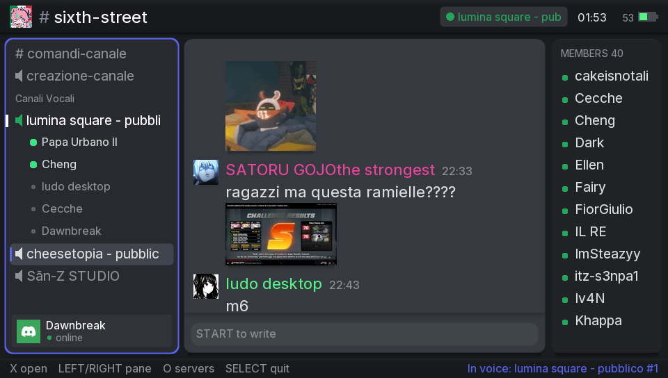
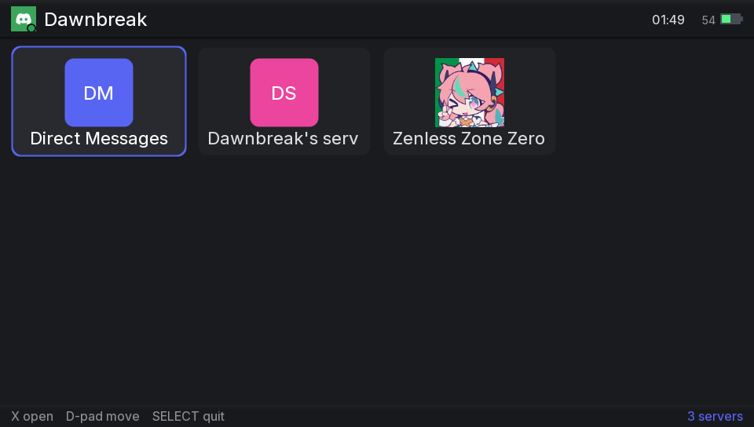
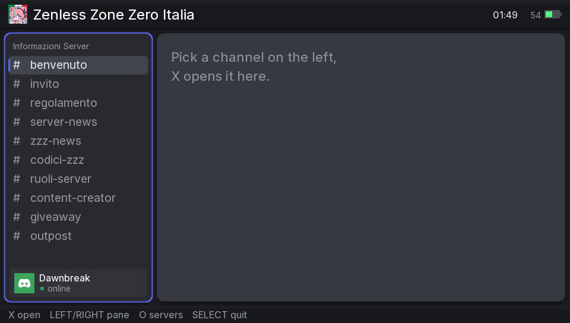
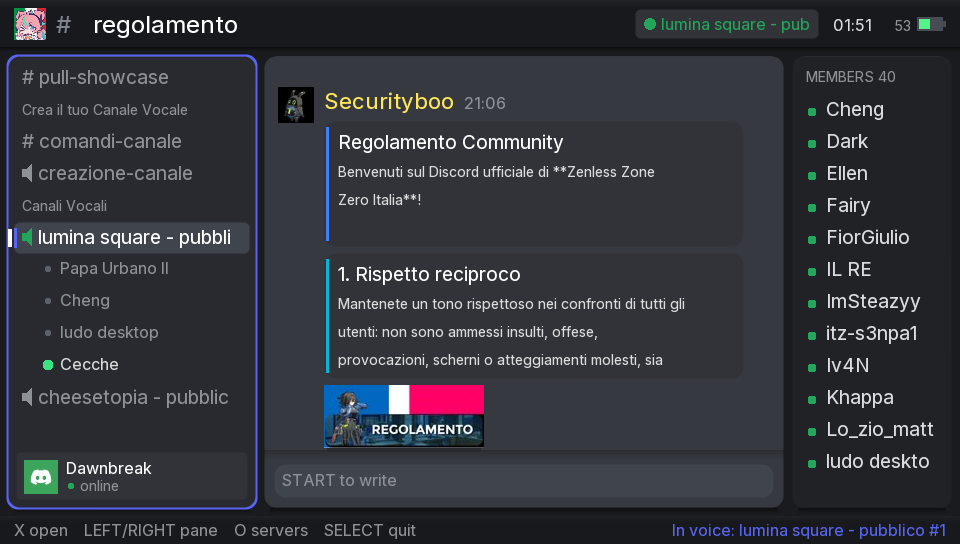

# DawnCord

A Discord client for the PlayStation Vita. It runs natively on the
console and talks to a companion program on your PC over the local
network, which handles everything the Vita cannot: servers, DMs, live
chat, images and voice channels.

## Download

Two files from the [releases page](../../releases):

| File | Where it goes |
|------|---------------|
| `DawnCord.vpk` | the Vita, installed with VitaShell |
| `DawnCord-Companion.exe` | the PC, just run it and leave the window open |

On first run the companion asks for your Discord token and shows a pairing
code. Start the app on the Vita, it finds the PC by itself, asks for that
code once and remembers everything. The full walkthrough, token guide
included, is in [docs/install.md](docs/install.md).

The same release carries two alternatives. `DawnCord-Companion-folder.zip`
is the identical program shipped as a folder, which antivirus software
objects to far less often; take it if yours deletes the .exe, and see
[the FAQ](docs/faq.md) for why that happens. On Linux and macOS there is
no prebuilt binary: run `./start-companion.sh` from a clone.

## What is this?

Another Discord client for the PS Vita, built around what Discord looks
like now rather than what it looked like in 2016. It takes inspiration
from [VitaCord](https://github.com/devingDev/VitaCord), which dates back
to when Discord had just come out and is missing most of what was added
since.

The Vita never talks to Discord directly. TLS, the gateway, image
decoding and the voice codec all run on the PC, and the console receives
something simple enough for hardware from 2011 to handle. That is also
why the client fits in under a megabyte.

It was vibe-coded with Claude by a sysadmin who reads code better than he
writes it. The longer story, and what I think about that, is in
[docs/about.md](docs/about.md).

## What it looks like

| Your servers | Inside a server |
|---|---|
|  |  |

| Embeds and voice | Chat with images |
|---|---|
|  |  |

## What works

- Live chat: messages arrive as they are sent rather than by polling,
  with avatars, embeds, tappable image previews and a typing indicator
- Channels, chat and member list side by side, with the column you are
  using taking the space it needs
- Voice channels: join one to listen, see who is connected and who is
  talking. This is the newest part and the least settled.
- Writing through the console's own on-screen keyboard
- The console finds the PC on the network by itself, and reconnects on
  its own if the link drops
- TrueType text throughout, rendered on the console at 60fps

Being worked on, in this order: the microphone, so you can talk back;
voice that keeps running when you launch a game, which needs a taiHEN
plugin rather than an app; an update check; animated emoji. None of
these exist yet.

A note on voice: Discord has end-to-end encrypted calls since March 2026,
and the companion is the end that holds the keys, so the console only
ever receives audio that is already decoded. Listening works; the
microphone is not built yet. [docs/tech.md](docs/tech.md) has the
details.

## Is it safe?

The companion logs in with your own user token, which makes it a
self-bot, and automating a user account is against Discord's Terms of
Service. The risk looks small for this kind of use, since the companion
reads what you would read and sends what you type at the speed you type
it, but nobody outside Discord can promise anything. Use a throwaway
account if that bothers you. The longer answer is in
[docs/faq.md](docs/faq.md).

## Controls

| Button | Action |
|--------|--------|
| D-pad / sticks | move selection, scroll the focused column |
| Left/Right or L/R | move focus: channels, chat, members |
| Cross | open server / channel, join voice |
| Circle | back to the server list |
| Square | mute voice playback |
| Triangle | refresh messages and members |
| Start | write a message |
| Select | quit |

## More

- [docs/install.md](docs/install.md): full setup, the token guide,
  running from source, config files
- [docs/tech.md](docs/tech.md): how it works inside, the protocol,
  building and testing
- [docs/faq.md](docs/faq.md): the ban question at length, sizes, fonts,
  why a PC is needed
- [docs/about.md](docs/about.md): the story behind the project, credits

## License

MIT, see [LICENSE](LICENSE). Vendored cJSON keeps its own MIT notice.
